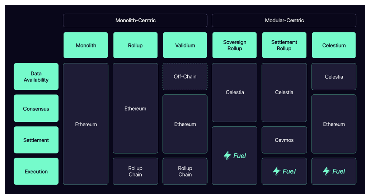

[TOC]

- 参考
  - 以太坊状态树 https://www.bcskill.com/index.php/archives/1253.html
  - 以太坊状态树 https://blog.csdn.net/shn111/article/details/122558968
  - 以太坊系统架构 https://www.graduate.nu.ac.th/wp-content/uploads/2019/05/4_Ethereum_Archiecture.pdf

## 区块链

- 区块链技术是由分布式数据存储、点对点传输、共识机制、加密算法等计算机技术组成的新型应用模式。

- 通过区块链技术可以实现一个去中心化的系统。

- trustless

  - 系统中的共识节点可以达成一致的共识，不需要一个第三方的权威机构。

- decentralized

  - 是trustless的子集。
  - 任意的计算机节点都有机会成为系统中的共识节点。

- 分布式账本
  1. 去中心化
  2. 透明性性
  3. 不可篡改性
  
## 区块链系统的层级结构

1. 数据层

   - 从还没有记录交易信息的创世区块起，直到现在仍一直在新添加的区块，构成的链式结构，里面包含了区块链的交易数据、哈希函数、merkel树、非对称公私钥、时间戳等。
   - 保存了系统的所有状态。

2. 网络层

   - 包含P2P网络、数据传输机制、数据验证机制。
   - 保证了系统是去中心化的，人人都有机会参与进来。

3. 共识层

   - 通过P2P网络从交易池下载交易数据，将交易进行排序与打包，执行交易，通过共识机制确认哪一个节点的区块能被保存进系统内。（状态转换的有效性达成共识，交易的排序和最终确定性。）
   - 共识算法： PoW、PoS、DPoS、PBFT、dBFT 等。
   - 保证了系统状态的一致性。

4. 激励层

   - 通过奖励系统代币的方式鼓励计算机节点参与系统的交易验证和记账打包成区块。
   - 保证了系统的正常运行。

5. 合约层

   - 包括各种脚本、代码、算法机制及智能合约。
   - 保证了系统的可编程性。

6. 应用层

   - 区块链的展示层，封装了区块链的各种应用场景和案例。
   - 保证了普通用户也能使用区块链系统。

## 区块链系统的账本模型

### 比特币系统与UTXO模型

- UTXO全称为 unspent transaction outputs（未被花费的交易输出）。

- 比特币系统与UTXO模型

  - UTXO是指关联比特币地址的比特币金额的集合，是一个包含数据和可执行代码的数据结构。
  - 一个UTXO的基本单位是“聪”，“聪”是比特币的最小计量单位，一个比特币等于10^8聪。
  - 只要全网保留了所有未被花费的交易，比特币链就能运行。

- coinbase交易

  - 也称为创币交易，是区块的第一笔交易。
  - 比特币挖矿节点获得新区块的挖矿奖励，比如 12.5 个比特币，这时，它的钱包地址得到的就是一个 UTXO，这就是coinbase交易的输出。coinbase交易是一个特殊的交易，它没有输入，只有输出。

- UTXO的创建与销毁

  1. wallet_address_A 爆块奖励获取到了12.5枚比特币，则这12.5枚比特币都在一个UTXO里。
  2. 现在 wallet_address_A 把 10 枚比特币转给 wallet_address_B。
     - 转账流程是： wallet_address_A 转 10 枚比特币给 wallet_address_B ，同时转 2.5 枚比特币给 wallet_address_A 。
     - UTXO机制里执行的流程是：wallet_address_A 原来的拥有12.5枚比特币金额集合的UTXO被销毁， wallet_address_B 获取一个新的拥有10枚比特币金额集合的UTXO， wallet_address_A 获取一个新的拥有2.5枚比特币金额集合的UTXO。

- 防止双花

  - 定义：同一笔钱进行了两次交易
  - 生成新区块的时候，矿工会从以前的区块链中追溯，查看付款地址这次消费的比特币是不是以前没有被消费过。（即查看UTXO是否被销毁过）
  - 在比特币中，使用工作量证明算法的共识机制，负责出块的矿主检验每笔交易合法性，其它挖矿节点验证区块里交易的合法性。

- 缺点

  - 需要计算某个地址中的余额时，需要遍历整个网络中的全部相关区块。
  - 可编程性差。

- 优点

  - UTXO 模型是无状态的。即状态都被保存在每个UTXO里面，并不需要在网络里维护一个全局的状态。

### 以太坊系统与Account模型

- 以太坊系统与Account模型

  - Account模型态通过默克尔树的结构保存了所以状态。链的状态在区块中以 StateRoot 和 ReceiptRoot 等形式进行共识。
  - 太坊系统就像一个状态机，它接受一个又一个的 Transaction 并不停改变自己的状态。
  - 只要全网保留了最新的状态，以太坊链就能运行。

- 太坊系统为什么不像比特币系统一样直接使用哈希表存储数据，然后将哈希表组织成一棵Merkle tree用来证明交易的合法性？

  - 比特币系统中没有账户概念，交易由区块管理，而区块包含上限为4000个交易左右，每次发布一个区块对应一棵新的Merkle tree，一旦发布是不会改变的，所以Merkle Tree不是无限增大的。
  - 以太坊系统中，Merkle Tree用来组织账户信息，是要把所有的以太坊账户一起构建一个Merkle tree，这个数目比Bitcoin中的Merkle tree会大好几个数量级。
  - 以太坊系统中，实际上发生变化的仅仅为很少一部分数据，我们每次重新构建Merkle Tree代价很大。

- 以太坊账户的数据结构

  - nonce （通过这个关键字防止双花）
  - ether_balance
  - contract_code
  - storage

- 以太坊交易的数据结构

  - nonce（通过这个关键字防止双花）
  - from
  - to
  - input
  - value

- addr：账户地址，以太坊中用的账户地址是160位，也就是20个字节，一般表示成40个十六进制的数（0～f）。

- state：外部账户和合约账户的状态，包括余额、交易次数、合约账户还包括代码、存储。

- 以太坊中采用什么数据结构来管理所有账户地址对应的状态的呢？

  - 采用的是MPT（Merkle Patricia Trie）树，即默克尔前缀树。
  - MPT是由 Merkle Tree、Patricia Tree(Trie) 和一些改进发明的

- Patricia Trie 是一种升级版的 Trie，不同之处在于：

  - 非根节点可以存储字符串，而不是只能存储字符。
  - 因此当一个非根节点仅有一个子节点，则将其子节点与该节点合并，也就是路径压缩了的 Trie。
  - 节省了在内存空间的开销。
  - 增加了存储空间的开销。

- 以太坊账户余额这样的数据并不直接保存在以太坊区块链的区块中。区块中只保存三种树的根节点哈希值。

  - 交易树 Transaction Trie
  - 世界状态树 World State Trie， 世界状态树是地址和帐户状态之间的映射。账户存储树（account storage contents trie）在世界状态树中构造叶节点。
  - 收据树 Receipt Trie

## 区块链系统的分叉问题

1. 分叉的原因：

   - 产生孤块(orphant block)。

2. 孤块的原因：去中心化、区块间隔、数据一致性

   - 去中心化程度越高，网络环境越差，将导致block和tx的全网同步速度变慢和节点间的状态难以时刻保持同步。
   - 区块间隔越短，节点越容易在非最新的高度上出块。

3. 分叉的结果

   - 区块链系统网络从此一分为二。

4. 分叉的缓解

   - Bitcoin网络，平均每10分钟产生一个块，区块链间隔时间比较长，在网络比较差的情况下各个节点状态也能保持同步，所以比较难产生孤块。
   - Ethereum ETH1.0网络，平均15秒产生一个块，通过特殊的机制去激励新产生的块去包含孤块，让新块和孤块都可以获得奖励，以此来缓解分叉的产生。
   - Filecoin网络，通过预期共识机制进行选举，在指定回合中可以选举多个矿工作为领导者，每个区块集合（tipset）包含1个或多个有效的同级区块。

5. 解决分叉

   - Bitcoin网络，通过最长链原则解决分叉。
   - Ethereum ETH1.0网络，通过最长链原则解决分叉。
   - Filecoin网络，通过tipset权重解决分叉。

## 区块链系统的不可能三角问题

- Blockchain Trilemma
- 不可能三角问题，是指目前没有任何一个区块链系统可以同时实现这三个特性。

1. Secure 安全性： 获得网络控制权需要花费的成本巨大以至于无法实现。
2. Throughput 可扩展性： 每秒钟可以处理大量的交易。
3. Decentralization 去中心化： 大量的参与者参与区块的生成和验证，不会受到一小群大型中心化参与者的控制。

## 区块链系统的模块化

- 将单体的区块链系统转变为由多个独立的服务组成的区块链系统。
- 

1. 执行层 Execution

   - 交易和状态的改变首先会在这里进行处理，最后才会更新进共识层。通常用户也会通过执行层与系统进行交互，包括签名交易、部署智能合约以及转移资产。

2. 结算层 Settlement

   - 结算层用于验证 rollup 的执行结果以及解决争议。它不存在于单一型链中，是模块化堆栈的可选部分。类比一下，对于美国法院系统来说，结算层就好比它的最高法院，在争议问题上提供最终裁决结果。

3. 共识层 Consensus

   - 共识是指节点就区块链上的哪些数据可以验证为真实和准确的达成协议的机制。共识协议决定了交易的排序方式以及如何将新区块添加到链中。

4. 数据可用层 Data Availability