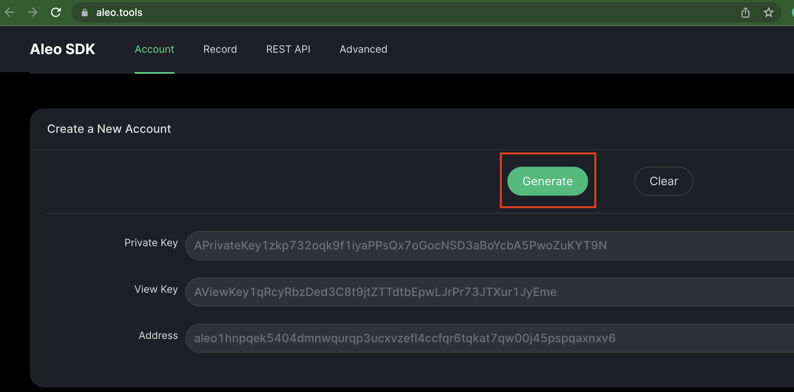
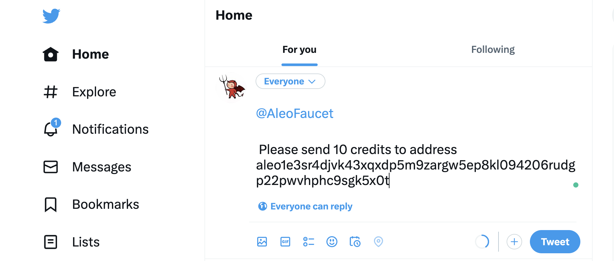
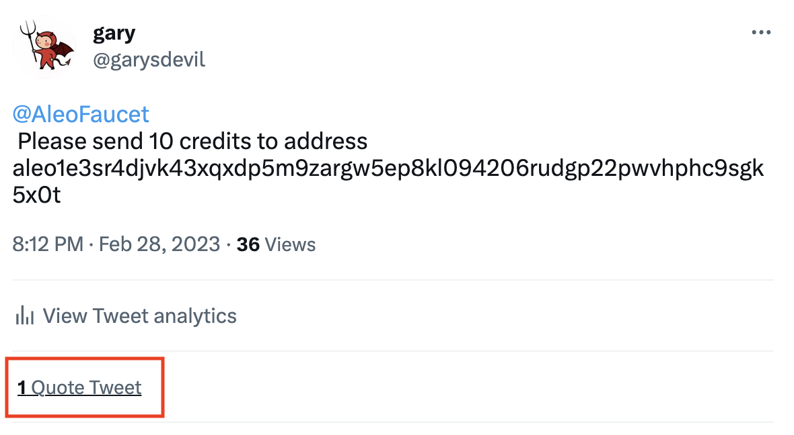
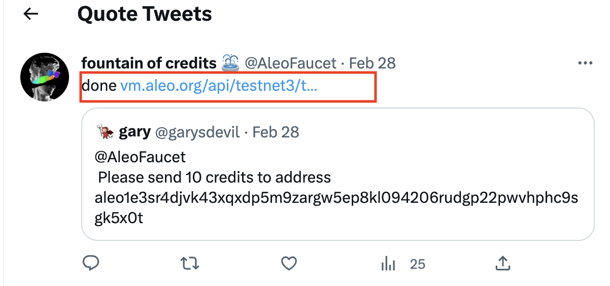
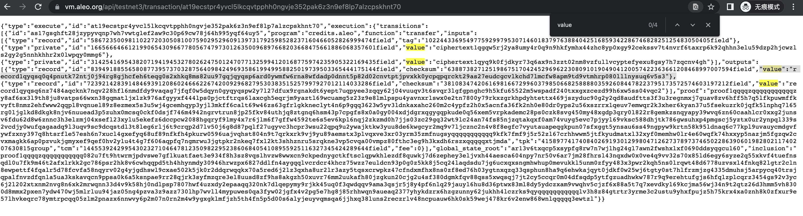
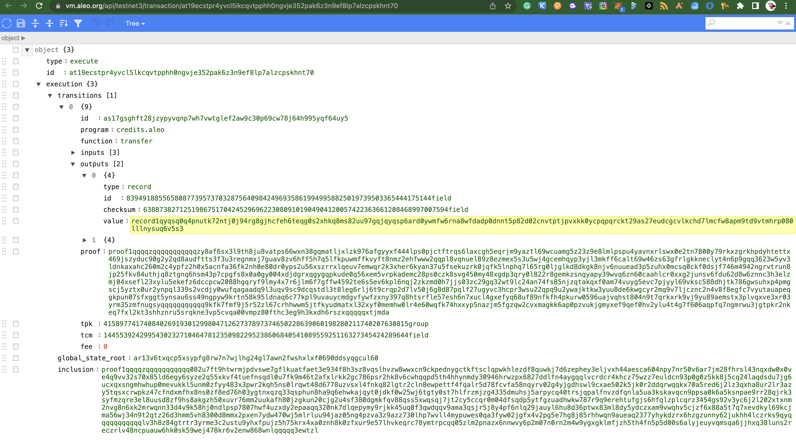
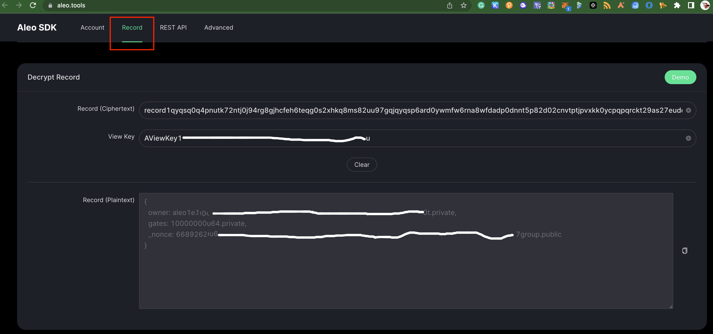

[TOC]

- 相关资料链接 
    - 官方部署文档 https://developer.aleo.org/testnet/getting_started/deploy_execute_demo/
    - 查看链上所有的程序 https://explorer.hamp.app/programs
    - 测试网领水 https://twitter.com/AleoFaucet
    - Aleo SDK在线工具 https://aleo.tools/
    - snarkOS源码 https://github.com/AleoHQ/snarkOS
    - leo源码 https://github.com/AleoHQ/leo
    - Aleo CSDN http://t.csdn.cn/BUUAx


## 安装相关软件
- 安装cargo、snarkos、leo

```bash
# 1. 下载安装Rust工具链管理器（内涵Rust编译工具）
curl --proto '=https' --tlsv1.2 -sSf https://sh.rustup.rs | sh
source $HOME/.cargo/env
# 查看是否安装成功，未输出找不到此命令则表示安装成功
cargo --version
```

```bash
# 2. 下载安装aleo隐私应用部署工具
git clone https://github.com/AleoHQ/snarkOS.git --depth 1
cd snarkOS
cargo install --path . --locked
# 查看是否安装成功，未输出找不到此命令则表示安装成功
```

```bash
# 3. 下载安装aleo隐私应用编译工具
git clone https://github.com/AleoHQ/leo --depth 1
cd leo
cargo install --path . --locked
# 查看是否安装成功，未输出找不到此命令则表示安装成功
leo
```

## 钱包数据准备
1. 生成钱包
    - 通过 https://aleo.tools/ 网站 Account 栏目的 Generate按钮生成，然后将 Private Key、View Key、Address 记录下来，在这里我们把这三个值分别命名为 private_key , view_key , wallet_dddress . 如下图所示。
    - 

2. 领水，在自己的推特账户上发表如下信息，从而获得测试代币。 如下图所示。
    ```
    @AleoFaucet
    
    Please send 10 credits to address 钱包地址
    ```
    


2. 验证是否领水成功
    - 等待5分钟后查看自己是否领水成功，领水成功的话，如下图红框内所示会得到 @AleoFaucet 的一个引用，然后点击红框内的 1 Quote Tweet。如下图所示。
    - 

3. 点击上图红框内内容后，就会跳转到下图，然后点击下图红框内的内容。如下图所示。
    - 

4. 点击上图红框内链接后，会返回一个Json字符串，如下图所示。将第三个value的内容复制下来，在这里我们称呼这个内容为 record_ciphertext ，是我们加密后的链上数据的记录。或者按下面的方式将Json字符串进行格式化后再进行复制。如下图所示。
    - 

5. 复制上图的 Json字符串通到  [json.cn](https://json.cn) 网站进行格式化，或者[安装谷歌插件json-beautifier-editor](https://chrome.google.com/webstore/detail/json-beautifier-editor/lpopeocbeepakdnipejhlpcmifheolpl)  后再打开红框内的链接即可得到如下图所示格式化后的数据。 将下图黄色背景的内容复制下来，在这里我们称呼这个内容为 record_ciphertext ，是我们加密后的链上数据的记录。如下图所示。
    - 


6. 游览器上打开 [aleo.tools](https://aleo.tools/)  ，选择 Record 栏目，然后将  record_ciphertext 数据复制粘贴到 Record (Ciphertext) 方框内，然后在View Key方框里输入自己的 view_key 的值， 网站就会自动解密得到 Record (Plaintext) 方框内的内容。在这里我们将Record (Plaintext) 方框内的内容称为 record_plaintext ，是我们解密后的链上数据的记录。如下图所示。
    - 

7. 记录好 private_key ,  wallet_dddress ,  record_plaintext 三个值，在接来下部署隐私应用的时候需要用到。

## 部署隐私应用
```bash
wallet_dddress="钱包地址wallet_dddress" # 填入自己的钱包地址
private_key="钱包私钥private_key" # 填入自己的钱包的私钥

app_name="helloworld_${wallet_dddress:0-6:6}" # 设置隐私应用名称，需要在Aleo网络里全网唯一，不能重名。因此我们截取钱包地址的部分字符串加入隐私应用名称内，以防止重名。
leo new "${app_name}" # 创建一个隐私应用
cd "${app_name}" && leo run && cd - # 进入隐私应用目录，进行编译，返回上层目录

# 定义 Record 的明文
record_plaintext="{
  owner: aleo1xvlh6eyfxxxxxxxxxxxxxxxxxxxxxxxxxxxxxxxxxxxxxxxxxxxxxxx.private,
  gates: 10000000u64.private,
  _nonce: 41689884563743409008191298xxxxxxxxxxxxxxxxxxxxxxxxxxxxxxxxxxxxxxxxxxxxxxxgroup.public
}"

# 执行部署操作
snarkos developer deploy "${app_name}.aleo" --private-key "${private_key}" --query "https://vm.aleo.org/api" --path "./${app_name}/build/" --broadcast "https://vm.aleo.org/api/testnet3/transaction/broadcast" --fee 600000 --record "${record_plaintext}" 
# 如下所示的日志，表示部署成功。
# 将交易ID记录下来（重要，查询交易记录以及进行进行下一次交易时都可能需要用到），例如 at1j97a8qmy6k2udaw9h9w34nu7wwahpkljnvvfpjvklht5uzwgsv8ss30g43 。
```
```log
📦 Creating deployment transaction for 'helloworld_gk5x0t.aleo'...

✅ Successfully deployed 'helloworld_gk5x0t.aleo' to https://vm.aleo.org/api/testnet3/transaction/broadcast.
at1j97a8qmy6k2udaw9h9w34nu7wwahpkljnvvfpjvklht5uzwgsv8ss30g43
```


- 通过网站 [explorer.hamp.app/programs](https://explorer.hamp.app/programs) 查看被部署进网络里的隐私应用。
- 输入 交易ID 进行查询，例如我这里部署成功后的交易ID为 at1j97a8qmy6k2udaw9h9w34nu7wwahpkljnvvfpjvklht5uzwgsv8ss30g43 。
