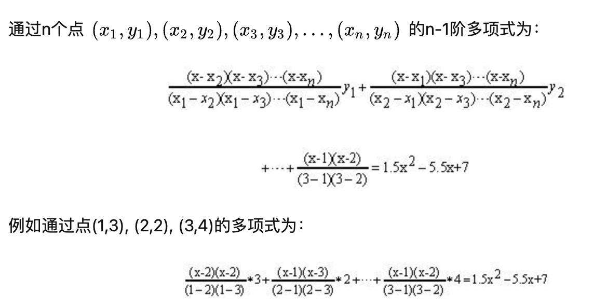

[TOC]

- 参考
    - https://medium.com/@VitalikButerin/quadratic-arithmetic-programs-from-zero-to-hero-f6d558cea649
    - https://blog.csdn.net/xiaozhupeiqi321/article/details/125064559?utm_medium=distribute.pc_aggpage_search_result.none-task-blog-2~aggregatepage~first_rank_ecpm_v1~rank_v31_ecpm-2-125064559-null-null.pc_agg_new_rank&utm_term=qap%E9%97%AE%E9%A2%98&spm=1000.2123.3001.4430
    - https://zhuanlan.zhihu.com/p/33307259
    - https://blog.csdn.net/guoyihaoguoyihao/article/details/103056359

## zkSNARKs工作原理

- 工作原理分为4步
    1. 将欲证明的计算性问题，转换成数学运算电路 Circuit
    2. 将数学运电路 Circuit 转换成 R1CS
    3. 将 R1CS 转变成 QAP 
    4. 基于 QAP 实现 zkSNARK 的算法
- 为什么要转为R1CS ？
    - 电路所代表的逻辑关系非常复杂，是很难直接推导出QAP多项式来的。所以往往需要借助一个中间媒介，把电路先转换为一组矩阵关系。这种矩阵关系，称之为R1CS程序矩阵。
- 为什么要转为复杂的QAP多项式？
    - 因为多项式的作用，可以理解为一个“杠杆”，或者叫“误差放大器”。
    - 如果我们要检查两个长(维)度为 10000 的向量是否相等，一定需要检查 10000 次，哪怕检查过了 9999 个点都是一样的，也不能保证最后一点是相同的。而两个 10000 次的多项式，哪怕非常接近，比如说它们的系数有 9999 个都相同，或者它们在这些点上的取值都相等，但只要有一个点不同，这两个多项式就截然不同。这意味着，如果在一个很大的范围内，例如 到 当中均匀随机选一个点，两个不同的多项式在这个点上相等的机会只有 。检查两个多项式是否相等，比检查同样规模的向量要快得多，这几乎是所有 zkSNARK 提高 Verifier 效率的根本原理。

### 0. 问题

- 对于方程，x**3 + x + 5 = 35，不透露答案但证明我知道这个立方方程的解。
- 证明方已知解是3，解用来构造witness，然后再通过witness构造零知识证明。验证者可以对零知识证明进行验证。

```python
def equation(x):
    y = x**3
    return x + y + 5
```

### 1. 将欲证明的计算性问题，转换成门电路 Circuit

1. 首先，我们将计算性问题 “拍平(Flattening)”，使之变成一个个门电路，我们可以将其拍平成 4 个门电路
    1. sym1 = x * x
    2. y = sym1 * x
    3. sym2 = y + x
    4. out = sym2 + 5
- sym1、sym2、y 是整个计算过程中用的临时变量，而 out 则代表计算过程的最终输出结果。
- 上面这4个表达式，称为4个约束条件。这四个约束条件，也可以被理解为4个门电路。

### 2. 将门电路转换成 R1CS 形式
- [什么是R1CS](### 什么是R1CS)

- 将4个门电路分别转为R1CS，需要用到的变量为 '~one', 'x', '~out', 'sym_1', 'y', 'sym_2'。

- 'x', '~out', 'sym_1', 'y', 'sym_2' 为转换成门电路时引入的变量； ~one 代表数字1。

- 证明方已知解向量witness。这几个临时变量就是解向量witness，因为我们知道 x=3，所以将它带入门电路声明的语句就可得到其他变量的解，因此witness为[1,3,35,9,27,30]，在这里称之为向量s。

- 将一个个门电路转为一个个R1CS
    ```
    ['~one', 'x', '~out', 'sym_1', 'y', 'sym_2']
    
    第一个门电路 sym1 = x * x 即  x * x - sym1 = 0 的R1CS为：
    a1 = [0, 1, 0, 0, 0, 0]
    b1 = [0, 1, 0, 0, 0, 0]
    c1 = [0, 0, 0, 1, 0, 0]
    
    第二个门电路 y = sym1 * x 即 sym1 * x - y = 0 的R1CS为：
    a2 = [0, 0, 0, 1, 0, 0]
    b2 = [0, 1, 0, 0, 0, 0]
    c2 = [0, 0, 0, 0, 1, 0]
    
    第三个门电路 sym2 = y + x 即 (y + x) * 1 - sym2 = 0 的R1CS为：
    a3 = [0, 1, 0, 0, 1, 0]
    b3 = [1, 0, 0, 0, 0, 0]
    c3 = [0, 0, 0, 0, 0, 1]
    
    第四个门电路 ~out = sym2 + 5 即 (sym_2 + 5) * 1 - ~out = 0 的R1CS为：
    a4 = [5, 0, 0, 0, 0, 1]
    b4 = [1, 0, 0, 0, 0, 0]
    c4 = [0, 0, 1, 0, 0, 0]
    ```
    
- 完整的R1CS为
    ```
    ['~one', 'x', '~out', 'sym_1', 'y', 'sym_2']
    A = [a1]
    		[a2]
    		[a3]
    		[a4]
    		[a5]
    ```
    ```
    A
    [0, 1, 0, 0, 0, 0]
    [0, 0, 0, 1, 0, 0]
    [0, 1, 0, 0, 1, 0]
    [5, 0, 0, 0, 0, 1]
    B
    [0, 1, 0, 0, 0, 0]
    [0, 1, 0, 0, 0, 0]
    [1, 0, 0, 0, 0, 0]
    [1, 0, 0, 0, 0, 0]
    C
    [0, 0, 0, 1, 0, 0]
    [0, 0, 0, 0, 1, 0]
    [0, 0, 0, 0, 0, 1]
    [0, 0, 1, 0, 0, 0]
    ```

### 3. 将 R1CS 转变成 QAP
- R1CS 是由向量组成的点积运算来描述问题， QAP 是使用多项式来描述问题。

- 使用拉格朗日差值公式来将 R1CS 转化为 QAP 形式。之后会将所有R1CS（四个长/维度为六的三向量组）转化为六组多项式。 

- 这里共有四个约束，因此使用 x = 1,2,3,4 。

- 先求出四个约束所对应的每个 a 向量的第一个值的多项式，也就是说使用拉格朗日插值定理求过点 (1,0), (2,0), (3,0), (4,5) 的多项式。
    - 将 (1,0), (2,0), (3,0), (4,5)，带入拉格朗日插值公式，求得一个多项式
    ```python
        = ((x-1) * (x-2) * (x-3)) / ((4-1) * (4-2) * (4-3)) * 5
        = 5/6 * x**3 - 5 * x**2 + 55/6 * x - 5
        ~= 0.833 * x**3 - 5 * x**2 + 9.166 * x - 5
    ```
    - 将 (1,1), (2,0), (3,1), (4,5)，带入拉格朗日插值公式...

- 最后分别求得四个约束 的多项式，为
    ```
    这些系数是按x的指数升序排序的，例如 0.833 * x**3 - 5 * x**2 + 9.166 * x - 5 对应 [-5.0, 9.166, -5.0, 0.833]
    
    A polynomials
    [-5.0, 9.166, -5.0, 0.833]
    [8.0, -11.333, 5.0, -0.666]
    [0.0, 0.0, 0.0, 0.0]
    [-6.0, 9.5, -4.0, 0.5]
    [4.0, -7.0, 3.5, -0.5]
    [-1.0, 1.833, -1.0, 0.166]
    B polynomials
    [3.0, -5.166, 2.5, -0.333]
    [-2.0, 5.166, -2.5, 0.333]
    [0.0, 0.0, 0.0, 0.0]
    [0.0, 0.0, 0.0, 0.0]
    [0.0, 0.0, 0.0, 0.0]
    [0.0, 0.0, 0.0, 0.0]
    C polynomials
    [0.0, 0.0, 0.0, 0.0]
    [0.0, 0.0, 0.0, 0.0]
    [-1.0, 1.833, -1.0, 0.166]
    [4.0, -4.333, 1.5, -0.166]
    [-6.0, 9.5, -4.0, 0.5]
    [4.0, -7.0, 3.5, -0.5]
    ```

- 解向量s[1,3,35,9,27,30]的第一个值，即x=1。当x=1时，检查多项式。把所有系数乘1，然后相加。例如 (-5.0 * 1) + (9.166 * 1) + (-5.0 * 1) + (0.833 * 1) = 0
    ```
    A results at x=1
    0
    1
    0
    0
    0
    0
    B results at x=1
    0
    1
    0
    0
    0
    0
    C results at x=1
    0
    0
    0
    1
    0
    0
    ```
    - 即如下所示，等同于第一个门电路，即检查通过。
    ```
    a1 = [0, 1, 0, 0, 0, 0]
    b1 = [0, 1, 0, 0, 0, 0]
    c1 = [0, 0, 0, 1, 0, 0]
    ```

### 4. 检验 QAP
- 通过将 R1CS 转换成 QAP 后，可以通过多项式的内积运算来同时检查所有的约束，而不是像R1CS 那样单独的检查每一个约束。

1. 将s[1,3,35,9,27,30]带入QAP多项式，例如 ``` (-5*1)+(8*3)+(0*35)+(-6*9)+(4*27)+(-1*30)=43 ```
    ```
    A . s = [43.0, -73.333, 38.5, -5.166]
    B . s = [-3.0, 10.333, -5.0, 0.666]
    C . s = [-41.0, 71.666, -24.5, 2.833]
    # 记住这是一个个多项式，例如 43.0 * X**3 - -73.333 * X**2 + 38.5 * X -5.166 = 0
    ```
2. 
    ``` 
    t = A · s * B · s — C · s
    t = [-88.0, 592.666, -1063.777, 805.833, -294.777, 51.5, -3.444]
    ```


3. 
    ``` 
    Z = (x - 1) * (x - 2) * (x - 3) * (x - 4)
    Z = [24, -50, 35, -10, 1]
    ```

4. 
    ```
    h = t / Z = [-3.666, 17.055, -3.444]
    ```

## 概念
### 什么是Circuit
- 任何计算问题都可以描述为一个个门电路。
- 门电路由加法门、乘法门以及一些常数门组成。

### 什么是R1CS
- R1CS（Rank-1 constraint system）(一阶约束系统).
- R1CS 是通过矩阵方式描述电路的一种语言。

- R1CS 的定义
  1. 是由三个向量(a, b, c)组成的方程，即  a * b -  c = 0。
  2. 向量 s 是 R1CS 的解。（解向量 s 就是 witness）。
  3. s 需要满足方程 s · a * s · b - s · c = 0。

1. 例如以下例子就满足R1CS。
    ```
    a = (5,0,0,0,0,1)，
    b = (1,0,0,0,0,0)，
    c = (0,0,1,0,0,0)，
    s = (1,3,35,9,27,30)，
    ```


### 多项式插值
- 通过多项式插值法，可以将向量a(a1,a2,a3,a4,...,an)转为多项式F(x)。

#### 拉格朗日插值公式

- 拉格朗日差值公式的作用是构造一个穿过指定点的多项式。

- 

## CRS
- 参考 https://zkproof.org/2021/06/30/setup-ceremonies/
### 什么是CRS
- zkSNARKs 依赖于一个 common reference string (CRS) 作为proving和verifying的公共参数。
- 这个CRS必须提前被一个可信任的第三方生成。 
- 用来创建CRS的信息被称之为‘toxic waste’。
- 攻击者可以使用‘toxic waste’来伪造欺诈证明，因此这些信息在CRS创建成功后需要被立即销毁。
### 如何安全的生成CRS
- 在zkSNARKs中，生成公共参数CRS的过程被称为“setup ceremony”。
- 目前安全地生成CRS首选方案是 multi-party computation (MPC)。
- 在通过MPC方案生成CRS后，各个参与方需要立即删除‘toxic waste’，否则了解这些输入的恶意方可能会利用 CRS 的底层数学结构来创建不可靠的证明。

### BGM17 MMORPG协议
- 在2017年， Bowe et al. 介绍了第二类 MPC 协议族 [BGM17](https://eprint.iacr.org/2017/1050.pdf)，解决第一类 MPC 的一些缺陷，专门用于 Groth16 等基于配对的 zk-SNARK。

- 生成CRS分为两阶段
    1. 该阶段称之为 Powers of Tau，生成公共参数。
    2. 将 Powers of Tau phase 转为一个 NP-relation-specific CRS. 

-  Filecoin, Ethereum (Semaphore), 和 Zcash Sapling 项目都使用了Powers of Tau来生成CRS。